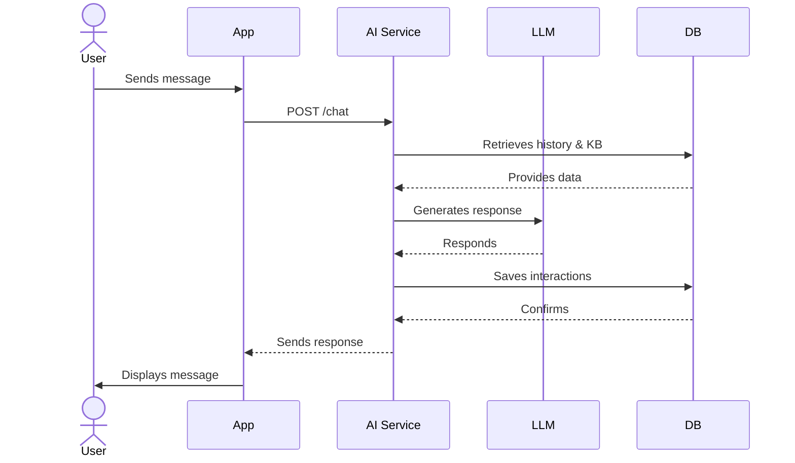
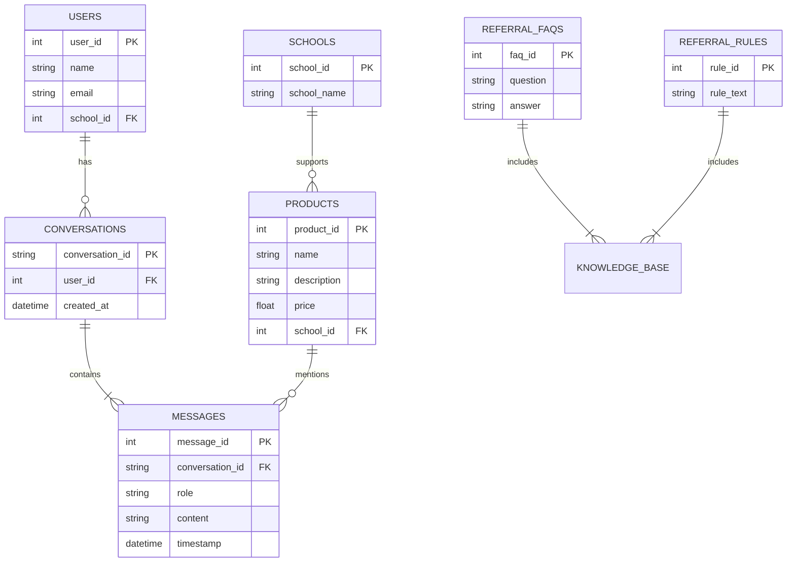

# Carton Caps AI Chat Assistant Prototype

This repository contains a proof-of-concept AI chat assistant developed for **Carton Caps**. The assistant provides personalized product recommendations and helps users navigate the app's referral program through engaging, multi-turn conversations.

## Project Context & Goals

Carton Caps enables consumers to support schools through everyday purchases. This AI-driven assistant enhances the existing app by:

- Offering personalized product recommendations tailored to user preferences and linked schools.
- Clarifying the referral program using integrated FAQs and rules.
- Facilitating natural, conversational interactions via an intuitive API endpoint.

## Live Protoype

[**https://cartoncapspoc.vercel.app/**](https://cartoncapspoc.vercel.app/)

*Note:* The demo uses a PostgreSQL instance hosted on Neon and environment variables configured within Vercel.

## Project Deliverables

### 1. Conversational AI Design & LLM Strategy

- **High-level Overview:** A customer-centric overview available at `/documentation.html` (accessible via the demo).
- **API:** Clearly documented API endpoints and interaction patterns using Swagger UI and ReDoc.
- **System Diagrams:** High-level sequence and database schema diagrams for easy onboarding of engineers.
- **Mobile Integration Potential:** Designed RESTful API suitable for seamless integration with mobile applications, enabling future features such as direct ordering based on purchase history.
- **Privacy & Security:** Conversations securely stored in PostgreSQL with controlled access. Data anonymization practices and limited PII handling to ensure privacy.
- **Design Principles:**
  - **Clarity and Consistency:** Structured prompts and explicit persona ("Capper"). Limited scope based on existing schema.
  - **Fallback Strategies:** Clear instructions to contact support if outside defined knowledge base.
  - **Real-world Considerations:** Selction of Gemini 1.5 Flash, balancing accuracy, cost, and performance. Future roadmap outlined, including enhanced scalability, agnostic LLM provider solutions, and context management improvements.

### 2. Prototype AI Service

- **Working FastAPI service:** Located in the `app/` directory, featuring:
  - Conversational interactions through `/chat` API endpoint.
  - Integration with Google Gemini API.
  - Advanced context handling via KB injection and conversation history management.
  - CRUD endpoints for managing Products, FAQs, and Referral Rules.
  - Unit and integration tests (`pytest`).
  - **Fully asynchronous API and database operations** (using SQLAlchemy async features).
  - **Environment variable validation** with startup checks to catch missing configurations.
  - **Authentication stub** for JWT token verification (prepared for future implementation).
  - **Enhanced LLM prompt security** to prevent prompt leakage and potential abuse.
  - **Comprehensive database error handling** with automatic transaction rollback and detailed error logging.

## Technical Details

### API Specification

Primary endpoint:

- `POST /chat`: Manages user messages and conversation states.

Interactive documentation:

- **Swagger UI:** [`https://cartoncapspoc.vercel.app/docs`](https://cartoncapspoc.vercel.app/docs)
- **ReDoc:** [`https://cartoncapspoc.vercel.app/redoc`](https://cartoncapspoc.vercel.app/redoc)

### LLM Integration

- **Model:** Google Gemini 1.5 Flash.
- **Context Sources:** User profiles, product catalog, referral FAQs/rules, conversation history.
- **Prompt Engineering:** Clearly defined persona ('Capper'), structured prompts with explicit context injection and fallback instructions.
- **History Management:** Optimized "First 1 + Last 9" turns strategy (up to 10 total turns from conversation history).
- **Security:** Explicit instructions to prevent prompt leakage and manipulation attempts.

### Testing

The project includes a suite of automated tests using `pytest` to ensure functionality and reliability.

-   **API/Integration Tests (`tests/test_api.py`):**
    -   These tests use FastAPI's `TestClient` to make live requests to the API endpoints (`/chat`, `/products`, `/faqs`, `/referral-rules`, etc.).
    -   They verify the full request/response cycle, including database interactions (CRUD operations) when a `DATABASE_URL` is configured in the environment.
    -   Includes tests for both happy paths and error handling (e.g., invalid user ID).
    -   One test (`test_chat_endpoint_real_db_and_llm`) specifically attempts a chat interaction that may involve a call to the actual LLM service if configured.
    -   **Async Testing:** Includes a specialized test (`test_chat_endpoint_is_async`) that verifies the asynchronous behavior of the API, ensuring concurrent requests are handled efficiently without blocking.

-   **LLM Integration Unit Tests (`tests/test_llm_integration.py`):**
    -   These are unit tests focused specifically on the `generate_response` function within `app/llm_integration.py`.
    -   They heavily **mock** database calls and the actual LLM interaction (using `unittest.mock.patch`).
    -   **Purpose:** To quickly and reliably test the internal logic of the function (e.g., prompt construction, context gathering, internal error handling) in isolation, without the cost or variability of real LLM calls.

**Running Tests:**

```bash
pytest
```

*Note:* API tests interact with the configured PG database URL in env. You may want to update references to a dedicated test database to avoid affecting production data when moving to production.

## Core Diagrams

### Sequence Diagram



### Database Schema



## Tech Stack

- Python 3.9+, FastAPI, PostgreSQL (Neon)
- Google Gemini API (`gemini-1.5-flash`)
- Uvicorn, SQLAlchemy (async), Psycopg2, asyncpg, Pydantic
- HTML, CSS, JavaScript
- Pytest

## Setup & Running

### Prerequisites

- Python 3.9+
- PostgreSQL database (Neon recommended)
- Git

### Installation

```bash
git clone <repo-url>
cd <repo-directory>
python -m venv .venv
source .venv/bin/activate
pip install -r requirements.txt
```

### Configure `.env`

```
DATABASE_URL=<postgres-connection-string>
GOOGLE_API_KEY=<gemini-api-key>
```

### Database Setup

- Execute `schema.sql` against your PostgreSQL database.

### Run Service

```bash
uvicorn app.main:app --reload --port 8000
```

### Access Service

- Chat UI: [http://localhost:8000](http://localhost:8000)
- Documentation: [http://localhost:8000/documentation.html](http://localhost:8000/documentation.html)

